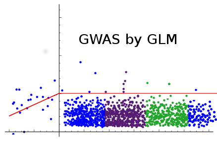

# CROPS545_HW4_GLM_GWAS
The GWAS_by_GLM package performs a genome wide association study using the generalized linear model by incorporating fixed effects such as PCA, clustered PCA, or user defined covariates. Furthermore, useful graphical outputs are generated to assist the user with data interpretation.

## Installation
To install this package directly from Github, the 'devtools' package is required. Then the 'install_github' function can be used to directly install the package along required dependencies and manual documentation.

Here are the R commands to do this:

library(devtools)

install_github('mtmcgowan/CROPS545_HW4_GLM_GWAS/GWASbyGLMwPCA', dependencies = T)

library(GWASbyGLMwPCA)

## Examples
To learn how to use the GWASbyGLM function, type this command into your R terminal:
help(GWASbyGLM)

To learn how to use the plot_manhattan function, type this command into yoru R terminal:
help(plot_manhattan)
